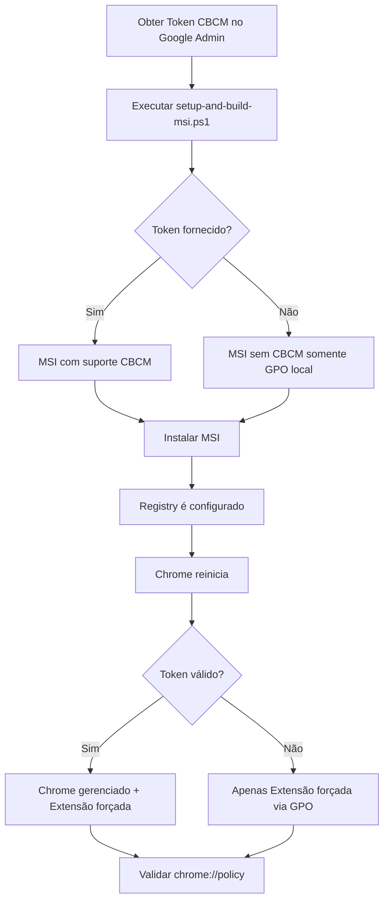

# 🔐 Integração CBCM (Chrome Browser Cloud Management)

## O que é CBCM?

O **Chrome Browser Cloud Management (CBCM)** permite gerenciar centralmente políticas do Chrome em organizações, tornando navegadores "gerenciados" sem necessidade de Active Directory/GPO.

### Benefícios

✅ Chrome mostra "Browser is managed" (aumenta confiança dos usuários)  
✅ Extensões forçadas aparecem como "Installed by your organization"  
✅ Gerenciamento via Google Admin Console (não depende de infraestrutura local)  
✅ Escalável para qualquer número de máquinas  
✅ Funciona em Windows, Mac, Linux  

---

## 📋 Pré-requisitos

1. **Conta Google Workspace ou Cloud Identity** (gratuito para gerenciamento de dispositivos)
2. **Token CBCM** obtido no Google Admin Console
3. **Secret `CHROME_CBCM_ENROLLMENT_TOKEN`** configurado no Lovable (já feito ✅)

---

## 🔑 Como Obter o Token CBCM

### 1. Acessar Google Admin Console
- Acesse: https://admin.google.com
- Faça login com conta de administrador

### 2. Habilitar Chrome Browser Cloud Management
- Navegue para: **Dispositivos** > **Chrome** > **Configurações**
- Clique em **Gerenciamento de navegador Chrome**
- Ative a opção **"Permitir gerenciamento de navegadores Chrome"**

### 3. Gerar Token de Inscrição
- Na mesma página, encontre a seção **"Token de inscrição"**
- Clique em **"Gerar novo token"**
- Copie o token gerado (formato: `XXXXX-XXXXX-XXXXX-XXXXX-XXXXX`)

⚠️ **IMPORTANTE**: O token é sensível! Trate como senha.

---

## 🛠️ Como Usar com o MSI Installer

### Opção 1: Modo Interativo (Recomendado)

Execute o script sem parâmetros e ele perguntará o token:

```powershell
.\setup-and-build-msi.ps1
```

O script coletará:
1. Extension ID
2. Manufacturer
3. **Token CBCM** (opcional, deixe vazio se não usar)

### Opção 2: Linha de Comando (Automação)

Passe o token diretamente via parâmetro:

```powershell
.\setup-and-build-msi.ps1 `
    -ExtensionId "kmcpcjjddbhdgkaonaohpikkdgfejkgm" `
    -Manufacturer "CorpMonitor Ltda" `
    -CBCMToken "XXXXX-XXXXX-XXXXX-XXXXX-XXXXX"
```

### Opção 3: Sem Token (Extensão sem CBCM)

O MSI funciona normalmente mesmo sem token:

```powershell
.\setup-and-build-msi.ps1 `
    -ExtensionId "kmcpcjjddbhdgkaonaohpikkdgfejkgm" `
    -Manufacturer "CorpMonitor Ltda"
```

Neste caso, a extensão será forçada via GPO local, mas o Chrome **não** estará "gerenciado".

---

## 📦 Como Instalar o MSI com Token

### Instalação Silenciosa com Token

```powershell
msiexec /i CorpMonitor.msi /qn `
    CHROME_ENROLLMENT_TOKEN="XXXXX-XXXXX-XXXXX-XXXXX-XXXXX"
```

### Instalação com Interface Gráfica

```powershell
msiexec /i CorpMonitor.msi
```

O token já estará embutido no MSI se foi passado no build.

---

## ✅ Validação após Instalação

### 1. Verificar Políticas do Chrome

Abra o Chrome e acesse:
```
chrome://policy
```

Você deve ver:
- ✅ **"This browser is managed"** (topo da página)
- ✅ Política `CloudManagementEnrollmentToken` presente
- ✅ Política `ExtensionInstallForcelist` com Extension ID correto

### 2. Verificar Extensão

Acesse:
```
chrome://extensions
```

Você deve ver:
- ✅ **CorpMonitor Extension** instalada
- ✅ Badge "Managed - installed by your organization"
- ✅ Ícone fixado na toolbar (não pode ser removido)

### 3. Verificar Registry (Windows)

Abra PowerShell como Administrador:

```powershell
# Verificar Token CBCM
Get-ItemProperty -Path "HKLM:\SOFTWARE\Policies\Google\Chrome" -Name "CloudManagementEnrollmentToken"

# Verificar ExtensionInstallForcelist
Get-ItemProperty -Path "HKLM:\SOFTWARE\Policies\Google\Chrome\ExtensionInstallForcelist" -Name "1"
```

### 4. Google Admin Console (Opcional)

Após 10-15 minutos, o Chrome aparecerá no Google Admin Console:
- **Dispositivos** > **Chrome** > **Navegadores gerenciados**

---

## 🔧 Funcionamento Técnico

### Registry Keys Criados

#### 64-bit (HKLM\SOFTWARE\Policies\Google\Chrome)
```
CloudManagementEnrollmentToken = "XXXXX-XXXXX-XXXXX-XXXXX-XXXXX"
CloudManagementEnrollmentMandatory = 1
```

#### 32-bit (HKLM\SOFTWARE\Wow6432Node\Policies\Google\Chrome)
```
(mesmas chaves)
```

### Condições de Instalação

O MSI **só escreve** as chaves CBCM se:
1. Propriedade `CHROME_ENROLLMENT_TOKEN` estiver definida
2. Token não estiver vazio

### Desinstalação

Ao desinstalar o MSI, as chaves CBCM são **removidas automaticamente**.

---

## 🚨 Troubleshooting

### Problema: Chrome não mostra "Browser is managed"

**Causas possíveis:**
1. Token inválido ou expirado
2. Registry não foi escrito
3. Chrome não reiniciou após instalação

**Solução:**
```powershell
# 1. Verificar se token está no Registry
Get-ItemProperty -Path "HKLM:\SOFTWARE\Policies\Google\Chrome" -Name "CloudManagementEnrollmentToken"

# 2. Fechar TODOS os processos do Chrome
Get-Process chrome | Stop-Process -Force

# 3. Reabrir Chrome e verificar chrome://policy
```

### Problema: Token aparece mas extensão não instala

**Causas possíveis:**
1. `update_url` incorreto
2. Arquivo `.crx` inacessível no servidor
3. SHA256 hash não bate

**Solução:**
```powershell
# Verificar update_url no Registry
Get-ItemProperty -Path "HKLM:\SOFTWARE\Policies\Google\Chrome\ExtensionSettings\<EXTENSION_ID>" -Name "update_url"

# Deve retornar: https://monitorcorporativo.com/extension/update.xml
```

### Problema: "ERR_BLOCKED_BY_ADMINISTRATOR"

**Causa:**
Token CBCM está aplicado mas organização bloqueou extensões externas.

**Solução:**
No Google Admin Console:
1. **Dispositivos** > **Chrome** > **Apps e extensões**
2. Adicione o Extension ID à lista de permitidos

---

## 📚 Referências

- [Chrome Browser Cloud Management - Overview](https://support.google.com/chrome/a/answer/9116814)
- [Chrome Enterprise Policy List](https://chromeenterprise.google/policies/)
- [Enrollment Token Setup](https://support.google.com/chrome/a/answer/9303679)
- [Force Install Extensions](https://support.google.com/chrome/a/answer/7679408)

---

## 🎯 Resumo do Fluxo



---

## 🔐 Segurança

### Boas Práticas

✅ **NUNCA** commite o token no Git  
✅ Use o secret `CHROME_CBCM_ENROLLMENT_TOKEN` do Lovable  
✅ Passe token via linha de comando ou variável de ambiente  
✅ Rote tokens periodicamente (6 meses)  
✅ Use tokens diferentes para dev/staging/prod  

### MSI Security

O token CBCM **não fica hardcoded** no MSI:
- É passado em runtime via `CHROME_ENROLLMENT_TOKEN`
- Mesmo MSI pode ser usado com tokens diferentes
- Token só é escrito no Registry da máquina destino

---

## 📞 Suporte

Para dúvidas sobre CBCM:
- Documentação: https://docs.lovable.dev
- Suporte Google Admin: https://support.google.com/chrome/a

---

**Criado em**: 2025-10-19  
**Versão**: 1.0.0  
**Autor**: CorpMonitor Team
